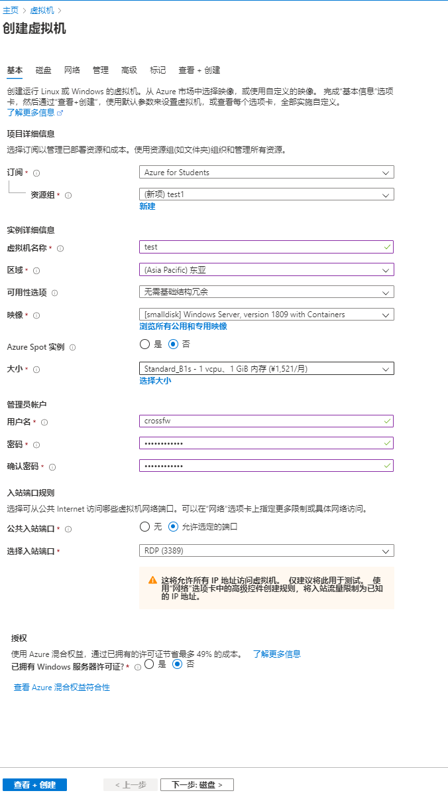
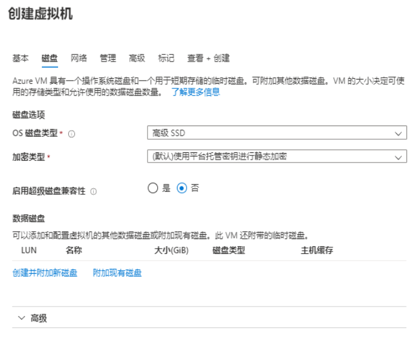
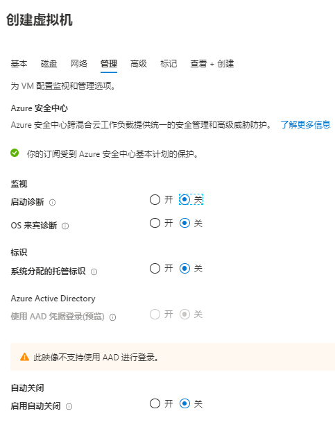
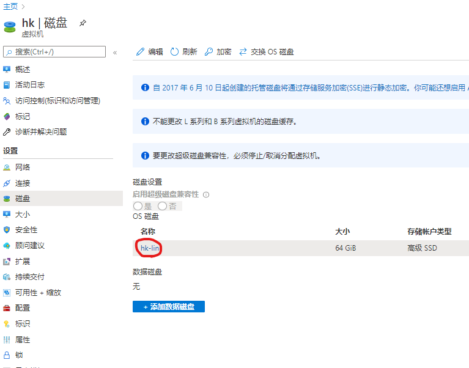
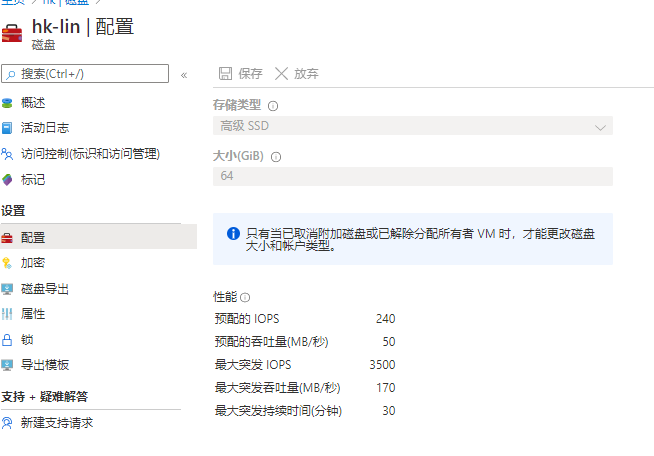
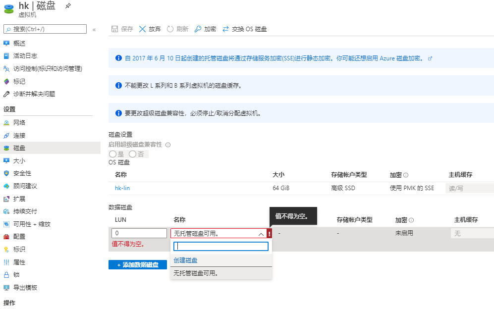
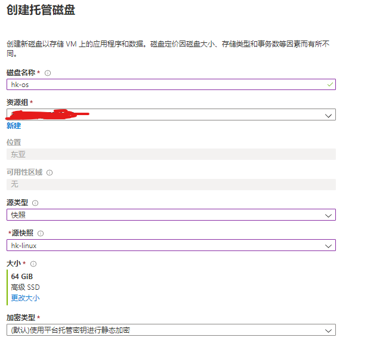
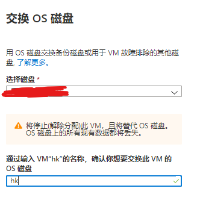
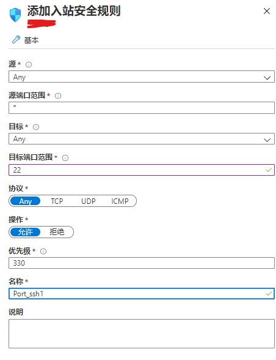
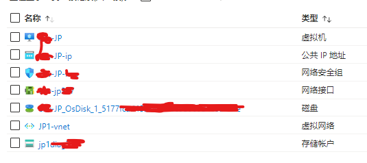

# Azure Windows 安装Linux方法

## 一个账号
Azure学生订阅有$100的配额，12月的使用期限以及每月1500小时的B1s虚拟机。<br>
其中1500hours的B1s只有750h的Linux与750h的windows。严重影响白嫖心情。<br>

## 部署Windows虚拟机
### 创建
在上方搜索框搜索“虚拟机”，进入后选择 添加-虚拟机


在以下选项中，需要输入如下设置。<br>
* 新建资源组
* 虚拟机名称
* 区域(东亚为香港机房)
* 映像([smalldisk] Windows Server, version 1809 with Containers)*
* 大小(Standard_B1s)**
* 用户名及密码<br>

映像请选择“浏览所有公用和专用映像” 输入“smalldisk”搜索。
大小请选择“选择大小”后搜索“B1s”进行选择。

配置完成后效果图如下



下一步，确定磁盘是高级ssd(premium SSD)



下一步，手动关闭启动诊断。



之后一路下一步创建即可。

### 修改磁盘大小

进入刚刚创建好的虚拟机页面，选择停止虚拟机，ip请不要选择保留，因为静态ip是收费的。点击 磁盘-OS磁盘第一个。



进入后选择 配置，把30G改成64G，确保是高级ssd，如果提示需要释放VM后才能配置，请关闭虚拟机，若已关闭，请等待关闭完成(通常在2分钟以内)



####  至此，一个普通的VM就配置完成了，但是，这个只有cmd窗口的win server我根本没(bu)法(hui)用啊！

## 更换系统

之前有veip007大佬做过windows “dd” linux的脚本，可惜现在缺少源文件下载不了了，而且包括az在内的一大批国外大厂均不提供物理层面的VNC服务，这使得重装又增加了不确定性，所以，我决定通过快照的方法“重装”。

### 创建快照

选择 你的虚拟机-磁盘-OS磁盘(与上文相同) - 创建快照, 按下图配置，然后一路下一步完成创建


回到虚拟机-磁盘<br>
选择添加数据磁盘-创建磁盘。



输入名称<br>
源类型选择快照<br>
源快照选择你刚刚创建的那个<br>
**千万注意更改磁盘类型至64G 高级SSD**



完成后请**不要**保存设置。即虚拟机-磁盘里还是只有一块OS磁盘。<br>
当点击“交换OS磁盘后，应当有磁盘可以选中交换。

### 创建linux虚拟机

方法与windows同理，建议选择Debian，在最后也请把磁盘调整至64G以免出现意外。<br>
需要注意的地方:
* 创建Linux时，第一页请选择使用密码登入而不是密钥登入
* 地区请确保一致

### 克隆磁盘

进入Linux虚拟机-磁盘，添加数据磁盘后选择刚刚通过快照创建的磁盘挂载，记得保存配置。<br>
重启虚拟机。
(此处可以先运行linux dd脚本安装你自己喜欢的系统，也可以最后装)

通过ssh登入,首先安装screen。
```bash
sudo apt update
sudo apt insyall screen -y
```
然后检查磁盘
```bash
sudo fdisk -l
```
应当出现 /dev/sda/ 与 /dev/sdc/ 两个64G盘<br>
(sdc可能从分区上看是30G的，因为里面装着windows)<br>
(盘符号可能不同)

检查无误后开始克隆
```bash
screen -S dd
```
按下回车后输入(请注意自行替换盘符号，盘符后无需加数字因为这是全盘克隆，确保sda是当前Linux盘(64G),sdc为挂载的windows数据盘)
```bash
sudo dd if=/dev/sda of=/dev/sdc bs=30M
```
之后按ctrl+A+D退出screen<br>
如果你要查看速度，请按以下步骤执行
```bash
screen sudo watch -n 5 pkill -USR1 ^dd$
```
ctrl+A+D退出
```bash
screen -r dd
```
请不要按任何可能会导致dd中止的按钮
耐心等待到64G吧。(大号U盘警告)


### 交换磁盘

克隆完成后(dd命令应自动结束)，关闭Linux虚拟机，从Linux虚拟机-磁盘-编辑-右键分离数据盘。<br>
Windows虚拟机-磁盘-交换OS磁盘,选择刚刚分离的磁盘。



打开"Windows"虚拟机-网络，添加22端口的入站规则。



结束所有操作，打开"Windows"虚拟机即可享用linux啦~

当检查无误后在上方搜索栏搜索”资源组“,进入资源组，删除所有不用的东西。<br>
这是一个干净的资源组，请务必确保对着名称删东西。



最后，如果你要在这里dd你喜欢的Linux系统，建议在检查完后留一个当前“伪win”机器的快照方便不时之需。
